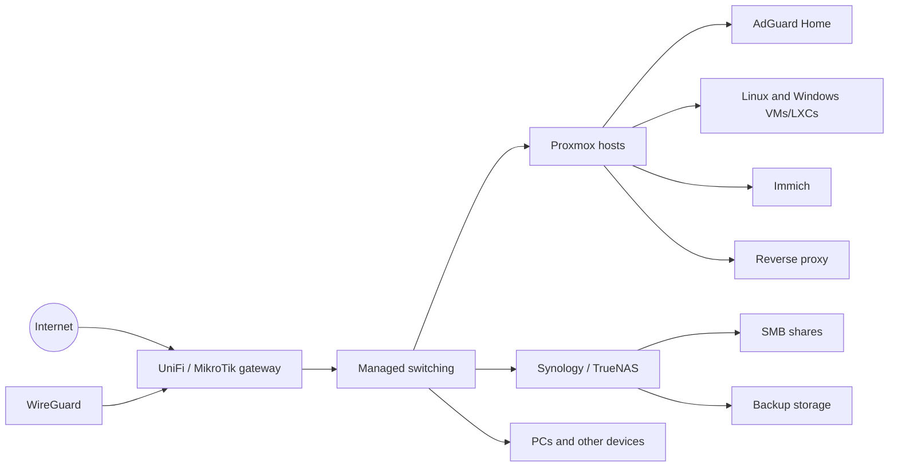

# Ewan Townsend-Commins — IT infrastructure portfolio

Hi, I’m Ewan. I work in IT support and infrastructure, and I spend a lot of my spare time building, breaking and rebuilding systems at home.

I started this repo because a CV can only say “Proxmox, Linux, networking and Microsoft 365” so many times. These notes show what I have actually worked on, why I set it up that way, what went wrong and how I fixed it.

Some of this is from professional support work and some is from my homelab. I keep that distinction clear. I do not publish customer information, production configurations, passwords, public IP addresses or anything else that should stay private.

## Start here

- [My homelab](docs/homelab/README.md)
- [Hardware](docs/homelab/hardware.md)
- [Network and DNS](docs/homelab/network.md)
- [Virtualisation](docs/homelab/virtualisation.md)
- [Storage and backups](docs/homelab/storage.md)
- [Services I run or have tested](docs/homelab/services.md)

## Project write-ups

- [Immich on Proxmox](docs/projects/immich.md)
- [Nextcloud Snap with a proper domain](docs/projects/nextcloud.md)
- [Web hosting, reverse proxies and certificates](docs/projects/hosting.md)
- [3CX, FreePBX and SIP](docs/projects/voip.md)

## Fixes and troubleshooting notes

- [Proxmox could not use an SMB share](docs/fixes/proxmox-smb-storage.md)
- [Internal DNS and conditional forwarding](docs/fixes/internal-dns.md)
- [Checking Certbot renewals properly](docs/fixes/certificates.md)

## What I have worked with

**Microsoft:** Windows 10/11, Windows Server 2019/2022/2025, Microsoft 365, Exchange-related support, Active Directory, user and device support, RDP and PowerShell.

**Virtualisation:** Proxmox VE, VMware ESXi 6.5/6.7/7, Hyper-V, Linux containers, Windows and Linux virtual machines.

**Linux:** Ubuntu, Debian, Nginx, systemd, permissions, SMB mounts, Docker, package management, logs and certificate troubleshooting.

**Networking:** MikroTik, UniFi, VLANs, DNS, DHCP, routing, WireGuard, firewall rules, policy routing and managed switching.

**Storage:** Synology, TrueNAS, SMB, iSCSI, RAID planning, VM storage, application data and off-site backup.

**Hosting and services:** Plesk, Nginx Proxy Manager, Certbot, Nextcloud, Immich, AdGuard Home, Mailu, Proxmox Mail Gateway, WordPress, PHP and SQL-backed applications.

**VoIP:** 3CX v20, FreePBX, Grandstream UCM, SIP registration, trunks, extensions and call routing.

## Current lab in one diagram

The diagram is deliberately simple. The detail is in the linked pages.

## A note on the hardware

A lot of the kit is older enterprise equipment. That is partly because it is affordable, and partly because it gives me hands-on experience with things a small business still uses: iLO/iDRAC, ECC memory, SAS disks, RAID controllers, noisy fans and hardware that does not always cooperate.

I do not run every server 24/7. Electricity is not free, and there is no point pretending my house is a datacentre.

## What I am working on next

My next priority is to add more useful automation rather than more documentation for the sake of it. That means Ansible, better PowerShell, repeatable Linux builds and proper restore tests.

The scripts in this repo are small on purpose. I would rather publish something I understand and have checked than paste in a huge script just to make the repository look busy.
