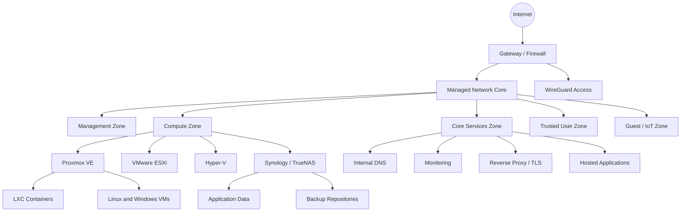

# Ewan Townsend-Commins

## Infrastructure Engineer · Technical Operations · 2nd/3rd Line Support

I am a UK-based IT professional with practical experience across managed services, Microsoft environments, virtualisation, networking, Linux and Windows administration, hosting, storage, backup, VoIP and technical operations.

This repository is an evidence-led portfolio of systems I have **supported professionally**, **built in my homelab**, or **delivered through independent technical projects**. It documents the reasoning behind the work: architecture, implementation, troubleshooting, security, recovery, change control and lessons learned.

> **Security and accuracy:** All examples are sanitised. Secrets, customer information, public addresses, serial numbers and live security rules are excluded. The portfolio distinguishes professional experience from lab and project work rather than presenting every activity as production experience.

---

## Start here

| Area | What it demonstrates | Link |
|---|---|---|
| **Technical evidence matrix** | Maps skills and job requirements to specific evidence in this repository | [View evidence matrix](docs/evidence-matrix.md) |
| **Homelab platform** | Full infrastructure design covering compute, network, storage, security and operations | [Read the homelab case study](docs/homelab/README.md) |
| **Hardware inventory** | Enterprise server, storage, network and power equipment I have worked with | [View hardware inventory](docs/homelab/hardware-inventory.md) |
| **Network design** | Segmentation, DNS, routing, remote access and troubleshooting methodology | [View network topology](docs/homelab/network-topology.md) |
| **Service catalogue** | Systems I have installed, configured, evaluated, migrated or supported | [View service catalogue](docs/homelab/service-catalogue.md) |
| **Case studies** | Problem → investigation → change → validation → lessons learned | [Browse case studies](docs/case-studies/README.md) |
| **Operational runbooks** | Repeatable response procedures for common infrastructure incidents | [Browse runbooks](runbooks/README.md) |
| **Scripts and examples** | Sanitised Bash, PowerShell, Docker and Nginx examples | [Browse scripts](scripts/README.md) |
| **Development roadmap** | Honest record of what is complete, in progress and planned | [View roadmap](ROADMAP.md) |

---

## Experience model

To keep the portfolio accurate, evidence is labelled using the following categories:

- **Professional:** Work performed in paid IT support, managed-service or technical operations roles.
- **Homelab:** Real systems personally designed, deployed and operated in a private environment.
- **Project:** Independent hosting, web, infrastructure or communications work delivered outside a formal employer environment.
- **Exploratory:** Technology installed or evaluated to develop understanding, without claiming long-term production ownership.

This distinction matters. A strong portfolio should demonstrate capability without exaggerating context.

---

## Core technical capabilities

| Capability | Technologies and evidence |
|---|---|
| **2nd/3rd line support** | Incident ownership, service requests, escalation, remote diagnosis, hardware/software support, user communication and root-cause investigation |
| **Microsoft platforms** | Windows client and server administration, Microsoft 365 support, Active Directory-related administration, Exchange concepts, Group Policy diagnosis and PowerShell |
| **Virtualisation** | Proxmox VE, VMware ESXi and Hyper-V; VM/LXC placement, virtual networking, storage integration, snapshots, migration and failed-start investigation |
| **Networking** | MikroTik, UniFi, VLANs, routing, DHCP, DNS, firewall policy, WireGuard, policy routing, switching and layered connectivity diagnosis |
| **Linux operations** | Ubuntu and Debian, systemd, journald, permissions, storage mounts, Nginx, package management, certificates, Docker and application troubleshooting |
| **Storage and recovery** | Synology, TrueNAS, SMB, iSCSI, RAID planning, NAS restrictions, local/off-site backup and recovery-oriented design |
| **Hosting and web operations** | Plesk, Nginx Proxy Manager, Certbot, WordPress, PHP, DNS, mail delivery, TLS and reverse proxying |
| **VoIP** | 3CX, FreePBX, SIP registration, extensions, trunks, dial plans, NAT and endpoint troubleshooting |
| **Monitoring and operations** | Availability checks, service dependencies, patching, certificate lifecycle, change planning, runbooks and post-incident documentation |

[See the full evidence matrix](docs/evidence-matrix.md).

---

## Featured infrastructure platform

My homelab is a working infrastructure environment used to practise the same disciplines required in support and infrastructure roles: controlled change, documentation, segmentation, diagnosis, security and recovery.

### Representative platform

- HPE ProLiant DL20 Gen9 and DL360 Gen9 servers
- Dell PowerEdge R430 and R320 systems
- Supermicro X10SDV-based low-power server platform
- Proxmox VE, VMware ESXi and Hyper-V
- Synology RackStation and TrueNAS storage
- MikroTik and UniFi networking
- Linux and Windows Server workloads
- AdGuard Home internal DNS and filtering
- WireGuard remote access
- Nginx and reverse-proxy services
- Immich, Nextcloud and other self-hosted applications
- 3CX and FreePBX lab/communications environments
- Monitoring, certificate management and backup workflows

Not every device or service is active simultaneously. The inventory records hardware and platforms I have personally worked with, while individual case studies identify the context in which each was used.

### Layered architecture



The public design uses generic zones and addresses. The important evidence is the trust model, dependency mapping and troubleshooting process—not disclosure of live security information.

[Read the full architecture and operating model](docs/homelab/README.md).

---

## Featured case studies

### Proxmox storage integration for application workloads

**Context:** A Linux service required persistent NAS-hosted data while keeping the application compute layer replaceable.

**Work demonstrated:** SMB mounting, credentials-file handling, Linux ownership and permissions, LXC bind mounts, dependency ordering, failure diagnosis and validation after reboot.

[Read the Proxmox and SMB storage case study](docs/case-studies/proxmox-smb-storage.md).

### Internal DNS and conditional forwarding

**Context:** Private services needed reliable names across a segmented environment without publishing internal records externally.

**Work demonstrated:** Resolver design, conditional forwarding, client DNS policy, split-horizon concepts, query testing and fault isolation.

[Read the internal DNS case study](docs/case-studies/internal-dns.md).

### Immich deployment with separated application data

**Context:** A self-hosted photo platform required predictable resource allocation and storage that could be backed up independently of the application host.

**Work demonstrated:** LXC/VM design decisions, storage mapping, application dependencies, update planning, backup scope and recovery sequencing.

[Read the Immich case study](docs/case-studies/immich-lxc.md).

### Nextcloud Snap domain and reverse-proxy configuration

**Context:** A Nextcloud Snap installation needed to accept a public domain correctly and behave predictably behind HTTPS.

**Work demonstrated:** trusted domain configuration, proxy awareness, certificate options, command-line administration and validation.

[Read the Nextcloud case study](docs/case-studies/nextcloud-snap-domain.md).

### SIP endpoint registration troubleshooting

**Context:** A VoIP endpoint had credentials but the correct registrar/endpoint settings were unclear.

**Work demonstrated:** separating registrar, proxy, authentication identity and extension details; checking NAT, transport, DNS and SIP responses.

[Read the SIP troubleshooting case study](docs/case-studies/sip-registration.md).

---

## Operational approach

### Incident handling

1. Confirm the impact, affected users and service boundaries.
2. Establish what changed and whether the fault is reproducible.
3. Separate client, identity, DNS, network, operating system, storage and application layers.
4. Gather evidence from logs, service state, routes, sockets, event records and monitoring.
5. Test one hypothesis at a time and avoid unrelated changes.
6. Restore service using the lowest-risk action available.
7. Validate from the user perspective—not only from the server console.
8. Document cause, resolution, rollback considerations and preventive action.

### Change handling

Before a significant change I aim to record:

- Purpose and expected outcome
- Dependencies and affected services
- Current configuration or version
- Backup/restore position
- Implementation sequence
- Validation checks
- Rollback trigger and method
- Documentation updates

### Recovery thinking

A running VM is not automatically a recoverable service. Recovery planning must include:

- Application configuration
- Databases and user data
- Storage credentials and mounts
- DNS and proxy records
- Certificates
- Dependencies and startup order
- A tested restoration sequence

[Browse the operational runbooks](runbooks/README.md).

---

## Example scripts

The repository includes sanitised examples intended to demonstrate operational thinking rather than replace organisation-specific tooling:

- Linux health and evidence collection
- Controlled Certbot renewal checks
- PowerShell support-bundle collection
- Docker Compose service examples
- Nginx reverse-proxy examples

All scripts should be reviewed in a test environment before use. They intentionally exclude credentials and live infrastructure details.

[Browse scripts and configuration examples](scripts/README.md).

---

## Repository structure

```text
portfolio/
├── README.md
├── ROADMAP.md
├── SECURITY.md
├── docs/
│   ├── evidence-matrix.md
│   ├── homelab/
│   │   ├── README.md
│   │   ├── architecture.md
│   │   ├── hardware-inventory.md
│   │   ├── network-topology.md
│   │   ├── networking.md
│   │   ├── service-catalogue.md
│   │   ├── services.md
│   │   ├── storage-backup.md
│   │   └── security.md
│   ├── case-studies/
│   │   ├── README.md
│   │   ├── proxmox-smb-storage.md
│   │   ├── internal-dns.md
│   │   ├── immich-lxc.md
│   │   ├── nextcloud-snap-domain.md
│   │   └── sip-registration.md
│   └── projects.md
├── runbooks/
│   ├── README.md
│   ├── linux-service-outage.md
│   ├── storage-unavailable.md
│   ├── certificate-renewal.md
│   └── vm-will-not-start.md
├── scripts/
│   ├── README.md
│   ├── bash/
│   └── powershell/
├── examples/
│   ├── docker/
│   └── nginx/
└── templates/
    └── project-case-study.md
```

---

## Current development priorities

- Add screenshots with sensitive information removed
- Add tested restore records and recovery timings
- Expand Microsoft 365, Windows Server and PowerShell evidence
- Build repeatable Ansible deployment examples
- Add monitoring and alert-response case studies
- Continue converting historical troubleshooting work into structured case studies

[View the detailed roadmap](ROADMAP.md).

---

## Contact

This repository is intended to accompany my CV and job applications. Contact details are provided directly to recruiters and employers rather than published in the repository.
