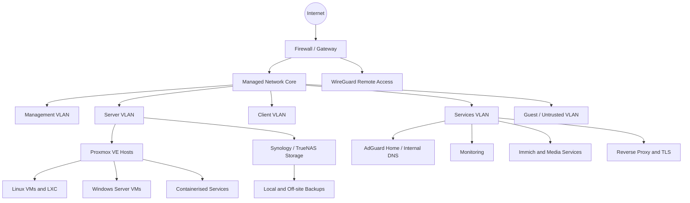

# Ewan Townsend-Commins

## Infrastructure, Technical Operations & Support Portfolio

I am a UK-based infrastructure and technical operations professional with hands-on experience across managed services, virtualisation, networking, Linux and Windows administration, hosting, VoIP, storage, monitoring and self-hosted platforms.

This repository documents practical systems I have designed, deployed, supported and improved. It is intended to show not only the technologies I have used, but how I approach architecture, troubleshooting, security, documentation and operational decision-making.

> **Security note:** Public examples are deliberately sanitised. Credentials, public IP addresses, customer information, production secrets and sensitive network details are never included.

---

## Core capabilities

| Area | Practical experience |
|---|---|
| **Virtualisation** | Proxmox VE, VMware ESXi, Hyper-V, virtual machines, LXC containers, resource planning and storage integration |
| **Networking** | VLANs, routing, firewall policy, DNS, DHCP, WireGuard, MikroTik, UniFi, switching and network segmentation |
| **Linux** | Ubuntu, Debian, Nginx, systemd, permissions, storage mounts, package management, TLS and service troubleshooting |
| **Windows** | Windows Server, Active Directory-related support, update policy, endpoint support and PowerShell administration |
| **Storage & backup** | Synology, TrueNAS, SMB, iSCSI, RAID planning, off-site backup and restore-oriented design |
| **Hosting & web operations** | Plesk, Nginx Proxy Manager, Certbot, DNS, mail flow, WordPress, PHP and service publishing |
| **VoIP** | 3CX, FreePBX, SIP registration, extensions, trunks, routing and PBX troubleshooting |
| **Operations** | Monitoring, incident diagnosis, technical documentation, change planning, customer support and service ownership |

---

## Featured project: Homelab infrastructure platform

My homelab is a working infrastructure environment used to develop and maintain skills that map directly to technical support, infrastructure engineering and IT operations roles.

It combines enterprise server hardware, virtualisation, segmented networking, centralised DNS, storage, backup, remote access, monitoring and multiple hosted services.

### High-level architecture



The published diagram describes the design pattern rather than exposing my live addressing or firewall configuration.

### What this project demonstrates

- Designing a segmented network rather than placing every device on one flat LAN
- Deploying and maintaining Proxmox-based virtual infrastructure
- Integrating SMB and other network storage with virtualisation hosts and services
- Running internal DNS and service discovery for local systems
- Publishing selected services through a reverse proxy with TLS
- Building remote-access paths using WireGuard instead of exposing management interfaces
- Diagnosing Linux permissions, mounts, certificates, DNS and application connectivity
- Planning backup around recoverability rather than treating file copies as a complete strategy
- Producing documentation that another engineer can follow

[Read the complete homelab case study](docs/homelab/README.md)

---

## Selected technical work

### Proxmox and service hosting

Deployed Proxmox environments using enterprise server hardware, with a mixture of virtual machines and LXC containers. Work has included storage integration, VM sizing, service migration, internal DNS, Linux administration and troubleshooting failed starts or inaccessible resources.

[Architecture and virtualisation notes](docs/homelab/architecture.md)

### Network segmentation and secure access

Worked with MikroTik and UniFi platforms to separate infrastructure, servers, users and less-trusted devices. Implemented internal DNS forwarding and WireGuard-based access to private services.

[Networking design](docs/homelab/networking.md)

### Storage and backups

Used Synology and TrueNAS systems with SMB and iSCSI, including restricted service access, virtualisation storage and off-site backup planning. Documentation focuses on failure domains, access control and restoration.

[Storage and backup strategy](docs/homelab/storage-backup.md)

### Linux-hosted platforms

Configured and supported services including Nginx, Plesk, Nextcloud, Docker-based applications, Immich, monitoring platforms, internal DNS and web applications. Typical work includes certificates, reverse proxying, permissions, service logs and application dependencies.

[Services catalogue](docs/homelab/services.md)

### VoIP and communications

Built and supported PBX environments using 3CX and FreePBX concepts, including SIP registration, extensions, trunks, routing and security considerations.

[Additional project summaries](docs/projects.md)

---

## Troubleshooting approach

My normal process is:

1. Define the user-visible impact and establish what changed.
2. Separate DNS, network, operating system and application layers.
3. Gather evidence from logs, service state, routes, sockets and configuration.
4. Test the smallest useful hypothesis rather than changing several things at once.
5. Restore service safely, then document the root cause and prevention steps.
6. Remove temporary access, test monitoring and confirm the result from the user perspective.

[See practical troubleshooting examples](docs/case-studies/troubleshooting.md)

---

## Current development goals

- Expand infrastructure-as-code skills using Ansible
- Build a stronger library of PowerShell and Bash operational scripts
- Add repeatable deployment and validation checklists
- Improve monitoring, alerting and tested recovery procedures
- Continue documenting technical decisions as concise case studies

---

## Repository structure

```text
portfolio/
├── README.md
├── docs/
│   ├── homelab/
│   │   ├── README.md
│   │   ├── architecture.md
│   │   ├── networking.md
│   │   ├── services.md
│   │   ├── storage-backup.md
│   │   └── security.md
│   ├── case-studies/
│   │   └── troubleshooting.md
│   └── projects.md
├── templates/
│   └── project-case-study.md
├── .gitignore
└── SECURITY.md
```

---

## About this portfolio

This is a living portfolio. It prioritises clear technical reasoning, safe documentation and honest descriptions of practical experience. Configuration examples may be added later where they can be published without exposing live systems or third-party data.
