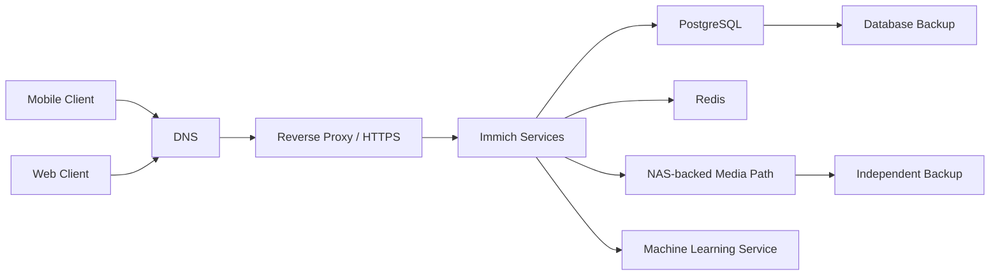

# Case Study: Immich Deployment in a Virtualised Environment

## Context

A self-hosted photo and video library was required to manage a growing personal media collection. Immich was selected because it provides mobile backup, library browsing, metadata processing and search while allowing the underlying data to remain on privately controlled infrastructure.

A representative deployment used a Linux LXC-based application host with approximately 8 GB memory and storage presented from a separate NAS-backed path. Exact hostnames, addresses and credentials are excluded.

---

## Requirements

- Provide a reliable private photo-management platform.
- Keep original media separate from disposable application compute where practical.
- Allow mobile and browser access.
- Support large-file uploads and background processing.
- Document databases, storage and proxy dependencies.
- Back up the components required for recovery.
- Avoid treating a VM/container snapshot as the only copy of the photo library.

---

## Main design decision: VM or LXC

Immich is normally deployed through containers. On a virtualisation platform, common choices include:

1. Docker inside a full Linux VM.
2. Docker inside an LXC container with nesting enabled.
3. Docker directly on a dedicated physical or virtual host.

### Full VM

**Advantages**

- Stronger isolation from the Proxmox host.
- Conventional Docker environment.
- Fewer LXC UID/GID and nesting complications.
- Easier to reproduce on another hypervisor.

**Disadvantages**

- Higher memory and storage overhead.
- Longer backup and restore times.
- Another full guest OS to maintain.

### LXC application host

**Advantages**

- Lower overhead.
- Fast startup and compact backup.
- Direct integration with Proxmox mount points.

**Disadvantages**

- Docker nesting requires additional consideration.
- Storage ownership can be more complex.
- Kernel and device access are shared with the host.
- Migration to a non-Proxmox environment may require more changes.

### Decision

An LXC-based host was used for one deployment because the workload was Linux-based and the environment benefited from low overhead. The limitations were accepted and documented. A full VM remains the preferred fallback if nested-container behaviour or device access becomes difficult to support.

---

## Logical architecture



This diagram highlights why checking only the main application container is not a sufficient health test.

---

## Resource planning

### Memory

A representative host was allocated around 8 GB RAM to support:

- Immich server components
- PostgreSQL
- Redis
- Machine-learning processing
- Thumbnail generation
- Operating-system overhead

Actual requirements vary with library size, concurrent uploads and background jobs. Memory should be monitored rather than assumed from an installation guide.

Useful checks:

```bash
free -h
vmstat 1 10
docker stats --no-stream
```

### CPU

CPU demand is often bursty during:

- Initial library import
- Metadata extraction
- Thumbnail generation
- Facial recognition or other machine-learning tasks
- Video transcoding

The platform should retain enough headroom that background processing does not make the user interface unusable.

### Storage

Storage planning distinguishes:

- Original uploaded media
- Generated thumbnails
- Encoded video
- PostgreSQL data
- Application configuration
- Container images
- Logs

Original media and the database are the most important recovery components. Generated data may be reproducible, but rebuilding it can take significant time and compute.

---

## Storage design

### Goals

- Keep originals on a defined NAS-backed data path.
- Make the mount visible only to the required application host.
- Ensure the application cannot silently use an empty local directory when the NAS is absent.
- Back up the database separately from the media library.

A host-mounted SMB path can be presented to the LXC as described in the [Proxmox SMB storage case study](proxmox-smb-storage.md).

Example application path:

```text
/srv/immich/library
```

Example checks:

```bash
findmnt /srv/immich/library
mountpoint -q /srv/immich/library
test -e /srv/immich/library/.storage-present
```

The sentinel file helps prove that the expected filesystem is mounted rather than an empty directory existing locally.

---

## Application deployment

A typical Compose-based Immich deployment has multiple services rather than one process. The exact official Compose file changes over time and should be obtained from the Immich project documentation for the installed release.

Operationally important files include:

```text
/opt/immich/docker-compose.yml
/opt/immich/.env
```

The environment file contains secrets and must not be committed to GitHub.

Useful lifecycle commands:

```bash
cd /opt/immich
docker compose pull
docker compose up -d
docker compose ps
docker compose logs --tail=100
```

Before an update:

1. Review the release notes and breaking changes.
2. Record the current version.
3. Confirm database and media backups.
4. Save the current Compose and environment configuration securely.
5. Pull the new images.
6. Start the updated stack.
7. Review migration and application logs.
8. Test login, upload, browsing and background jobs.

---

## Reverse proxy and access

Where the application is accessed through HTTPS, the proxy must support:

- The expected hostname
- Large request bodies
- Long-running uploads
- WebSocket/connection upgrade behaviour where required
- Suitable timeouts
- Correct forwarded headers

A generic Nginx-style example might include:

```nginx
location / {
    proxy_pass http://immich.internal.example:2283;
    proxy_set_header Host $host;
    proxy_set_header X-Real-IP $remote_addr;
    proxy_set_header X-Forwarded-For $proxy_add_x_forwarded_for;
    proxy_set_header X-Forwarded-Proto $scheme;
    client_max_body_size 0;
    proxy_read_timeout 600s;
    proxy_send_timeout 600s;
}
```

The exact recommended proxy settings should be checked for the deployed Immich version.

Remote access should not expose Proxmox, Docker or NAS management interfaces.

---

## Backup scope

### Media library

Protects original photos and videos. Options may include:

- NAS snapshots
- Backup to another local system
- Encrypted off-site copy
- Versioned backup

### PostgreSQL database

Protects:

- Users
- Albums
- Asset metadata
- Relationships and application state

A consistent database backup is required. Copying live database files without understanding consistency is not sufficient.

Example logical backup pattern:

```bash
docker exec -t immich_postgres \
  pg_dumpall --clean --if-exists --username=postgres \
  > /secure-backup/immich-postgres.sql
```

Container names and database users vary; the command must be adapted and tested.

### Configuration

Protects:

- Compose definition
- Non-secret configuration
- Secure copy of `.env`
- Proxy configuration
- DNS records
- Storage mount definitions

### Generated content

Thumbnails and transformed media may be reproducible, but including them can reduce recovery time. The decision should balance backup size against rebuild duration.

---

## Recovery sequence

1. Restore network, DNS and storage availability.
2. Restore the media library and confirm permissions.
3. Deploy a clean Linux application host.
4. Restore Compose and environment configuration.
5. Start the database service.
6. Restore the PostgreSQL backup.
7. Start remaining Immich services.
8. Restore or regenerate derived content as appropriate.
9. Reconnect the reverse proxy.
10. Validate login, asset count, sample media and mobile backup.

This sequence demonstrates why a VM snapshot alone is not a complete recovery plan.

---

## Monitoring

Useful checks include:

| Check | Purpose |
|---|---|
| Host reachability | Confirms basic network path |
| TCP/HTTP check | Confirms application port responds |
| Expected page/API result | Confirms application-level response |
| Container health | Identifies failed components |
| Database health | Confirms critical dependency |
| Storage mount | Prevents running against an empty path |
| Disk capacity | Prevents upload and database failure |
| Certificate expiry | Prevents avoidable access outage |
| Backup age | Identifies missing protection |

Example evidence commands:

```bash
docker compose ps
docker compose logs --tail=100
findmnt /srv/immich/library
df -h /srv/immich/library
curl -I https://photos.example.com/
```

---

## Troubleshooting examples

### Web interface returns 502 Bad Gateway

Check:

1. Proxy can resolve the internal application name.
2. Proxy can connect to the application port.
3. Immich server container is running.
4. Application logs do not show startup or database errors.
5. Firewall permits the proxy-to-application path.

```bash
getent hosts immich.internal.example
nc -vz immich.internal.example 2283
curl -v http://immich.internal.example:2283/
docker compose ps
docker compose logs --tail=200 immich-server
```

### Uploads fail but browsing works

Possible causes:

- Proxy body-size limit
- Timeout
- Storage permission
- Full filesystem
- Mobile client connectivity changes

Checks:

```bash
df -h
df -i
namei -l /srv/immich/library
docker compose logs --tail=200
```

### Background jobs stop processing

Check:

- Redis
- Database
- Machine-learning service
- Memory pressure
- Worker logs
- Container restart loops

### Photos appear missing after reboot

Immediately verify the storage mount before performing imports or library repair:

```bash
mountpoint -q /srv/immich/library
test -e /srv/immich/library/.storage-present
```

An unmounted path can appear as an empty local directory and should not be treated as genuine data loss until the storage layer is checked.

---

## Security considerations

- Application secrets remain in protected environment files.
- Proxmox, NAS and Docker management are not exposed publicly.
- Public access terminates at the reverse proxy.
- Storage access is limited to the application host and backup systems.
- Administrative accounts use strong unique credentials.
- Updates are applied after release-note and backup review.
- Shared links and user accounts are reviewed periodically.

---

## Rollback approach

For a failed update:

1. Preserve the updated logs.
2. Stop the new application stack.
3. Restore the prior Compose/image version.
4. Restore the database only if a migration made it incompatible.
5. Confirm the storage mount remains unchanged.
6. Start the previous version.
7. Validate login, asset browsing and uploads.

Database migrations may prevent a simple image rollback. This is why the database backup must be taken before the update and release notes reviewed first.

---

## Outcome

The deployment provided a practical, privately hosted media platform while creating real operational work across virtualisation, container hosting, storage, DNS, proxying, TLS, monitoring and backup.

---

## Lessons learned

- A photo platform is a multi-service application, not one container.
- Original media and database state require separate backup thinking.
- External storage improves separation but adds a critical dependency.
- LXC reduces overhead but introduces identity and nesting considerations.
- User-facing validation must include login, browsing, upload and background processing.
- Storage-mount monitoring is essential when the application path can exist without the NAS.
