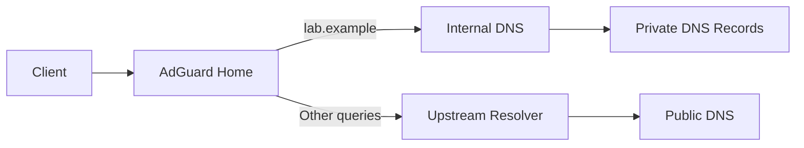

# Case Study: Internal DNS and Conditional Forwarding

## Context

The homelab contains multiple private services that should be reachable by memorable names rather than raw IP addresses. Public DNS is not appropriate for management interfaces and internal-only applications, so the environment uses an internal resolver and a dedicated private namespace.

AdGuard Home provides client-facing DNS and filtering. Queries for a private internal zone are forwarded to the resolver responsible for that zone, while normal internet queries follow the configured upstream path.

All names and addresses below are examples.

---

## Requirement

- Clients should resolve internal services consistently.
- Internal records should not be published to public DNS.
- AdGuard Home should remain the DNS service presented to clients.
- Queries for an internal zone such as `lab.example` should be forwarded to a dedicated internal resolver.
- Public queries should continue to use approved upstream resolvers.
- Troubleshooting should be possible at each stage of the query path.

---

## Why raw IP addresses were not sufficient

Using bookmarks or documentation containing IP addresses creates several operational problems:

- Service moves require every reference to be changed.
- Users cannot easily distinguish services by purpose.
- Certificates expect names rather than private addresses.
- Reverse proxies rely on hostnames.
- Monitoring becomes harder to interpret.
- IP-based access can hide DNS faults until a different application depends on them.

Internal DNS allows the address of a service to change without changing the user-facing name.

---

## Logical design



Example records:

| Name | Purpose | Published publicly? |
|---|---|---|
| `pve01.lab.example` | Proxmox host | No |
| `nas01.lab.example` | NAS service | No |
| `photos.lab.example` | Internal application | No or split-horizon, depending on need |
| `monitor.lab.example` | Monitoring | No |

---

## Namespace decision

The internal namespace should be deliberate.

Options include:

- A subdomain of a domain owned by the operator, such as `lab.example.com`
- A dedicated internal subdomain, such as `internal.example.com`
- Split-horizon use of the same application name internally and externally

Using an owned domain or subdomain avoids collisions and makes certificate planning clearer. Unofficial suffixes or names that may conflict with mDNS can create confusing behaviour.

The live internal namespace is not published in this repository.

---

## Implementation approach

### 1. Confirm the authoritative internal resolver

Before configuring forwarding, test the resolver directly:

```bash
dig @10.10.30.53 pve01.lab.example A
dig @10.10.30.53 lab.example SOA
dig @10.10.30.53 lab.example NS
```

This confirms that the destination resolver can answer the zone independently of AdGuard Home.

Expected outcomes:

- The host record returns the intended private address.
- The SOA record identifies the internal zone.
- Queries for unknown names return an appropriate negative answer rather than timing out.

### 2. Configure conditional forwarding

AdGuard Home can send queries for the private zone to a specified resolver using an upstream rule concept similar to:

```text
[/lab.example/]10.10.30.53
```

The exact interface and syntax should be checked against the installed AdGuard Home version. The important design is that only the private zone is forwarded to the internal resolver.

### 3. Configure normal upstream resolution

Public queries use approved recursive or forwarding resolvers. These are configured separately from the private-zone rule.

Checks should confirm that:

- Public resolution still works.
- The private resolver is not asked to resolve all internet names unless that is intentional.
- DNSSEC behaviour is understood.
- Filtering does not block required service domains.

### 4. Present AdGuard Home to clients

Clients should receive the approved DNS server through DHCP or documented static configuration.

Validation on Linux:

```bash
resolvectl status
cat /etc/resolv.conf
```

Validation on Windows:

```powershell
Get-DnsClientServerAddress
ipconfig /all
```

A common source of confusion is a client using a different resolver from the one being tested manually.

---

## Validation plan

### Test 1: Direct internal resolver

```bash
dig @10.10.30.53 pve01.lab.example
```

Proves that the internal DNS server knows the record.

### Test 2: AdGuard Home resolver

```bash
dig @10.10.30.10 pve01.lab.example
```

Proves that conditional forwarding works.

### Test 3: System resolver

```bash
getent hosts pve01.lab.example
resolvectl query pve01.lab.example
```

Proves that the client is using DNS through its normal operating-system path.

### Test 4: Public name

```bash
dig @10.10.30.10 github.com
```

Proves that normal upstream resolution remains functional.

### Test 5: Application access

```bash
curl -vk https://photos.lab.example/
```

Proves that name resolution leads to a reachable service. TLS and application behaviour are then evaluated separately.

---

## Failure scenarios

### Internal record works when querying the internal resolver directly but not through AdGuard Home

Likely areas:

- Conditional-forwarding rule not loaded
- Typo in zone suffix
- AdGuard Home cannot reach the internal resolver
- Firewall blocks TCP or UDP 53
- Query is being answered from stale cache

Checks:

```bash
dig @10.10.30.53 pve01.lab.example
dig @10.10.30.10 pve01.lab.example
nc -vz 10.10.30.53 53
journalctl -u AdGuardHome --since '30 minutes ago'
```

UDP is normally used for common queries, but DNS may fall back to TCP for larger responses. Both should be considered.

### Manual `dig` works but normal applications fail

Likely areas:

- The client is using another DNS server.
- A VPN client has replaced DNS settings.
- Browser secure DNS is bypassing the system resolver.
- A local cache contains an old answer.
- Search suffix behaviour is changing the name.

Checks:

```bash
resolvectl status
resolvectl flush-caches
getent hosts pve01.lab.example
```

On Windows:

```powershell
Get-DnsClientServerAddress
Resolve-DnsName pve01.lab.example
Clear-DnsClientCache
```

### Internal name returns the public address inside the network

Possible causes:

- Public DNS is being used instead of internal DNS.
- Split-horizon record is missing.
- Conditional forwarding is not matching the queried name.
- Cached public response remains on the client or resolver.

This can create hairpin NAT dependencies or expose an application path that was intended to remain internal.

### Resolution is intermittent

Possible causes:

- Clients receive multiple DNS servers with inconsistent records.
- One resolver is unhealthy.
- DHCP configuration differs between VLANs.
- Packet loss or firewall state affects DNS.
- A secondary resolver has not received zone updates.

Testing should repeat queries against each configured resolver individually.

### Name resolves correctly but application is unavailable

DNS is only one layer. Continue with:

```bash
ping -c 4 photos.lab.example
nc -vz photos.lab.example 443
curl -vk https://photos.lab.example/
```

Then inspect routing, firewall, reverse proxy and application logs.

---

## Caching considerations

DNS caching improves performance but can make changes appear inconsistent.

When changing a record:

- Understand the previous TTL.
- Change TTL in advance for planned migrations where appropriate.
- Flush only the relevant cache when possible.
- Avoid repeatedly changing records while caches are still active.
- Test against authoritative, forwarding and client resolvers separately.

Example query showing TTL:

```bash
dig pve01.lab.example
```

---

## Split-horizon considerations

Some services may use the same hostname internally and externally but return different addresses.

Example:

- External users resolve `cloud.example.com` to a public reverse proxy.
- Internal users resolve the same name to a private proxy address.

Advantages:

- Users use one consistent URL.
- Certificates and application hostnames remain consistent.
- Internal traffic can avoid unnecessary public routing.

Risks:

- Different answers can complicate diagnosis.
- Internal and public proxy configurations may drift.
- VPN clients need a deliberate DNS path.

Split-horizon DNS should therefore be documented per service rather than used implicitly.

---

## Security considerations

- Internal management records are not published publicly.
- DNS administration is restricted.
- Clients use approved resolvers where practical.
- Guest/IoT networks do not receive unnecessary management names.
- Query logging is treated as sensitive operational data.
- Zone transfers are restricted.
- Resolver recursion is not exposed openly to the internet.

DNS filtering is not treated as a complete security control. It complements endpoint, firewall and application security.

---

## Monitoring

Useful checks include:

- Resolver process is running.
- TCP/UDP 53 is reachable from expected networks.
- A known internal record resolves correctly.
- A known public record resolves correctly.
- Upstream latency remains acceptable.
- Conditional-forward destination is reachable.

An effective DNS monitor tests actual queries rather than only pinging the resolver host.

---

## Rollback

If conditional forwarding caused widespread resolution problems:

1. Record the current rule and logs.
2. Remove or disable only the private-zone rule.
3. Confirm public DNS remains available.
4. Directly test the internal resolver.
5. Restore the last known working rule.
6. Flush resolver/client cache only where needed.
7. Validate internal and public names from each affected VLAN.

---

## Outcome

The design provided stable internal names while keeping private records out of public DNS. It also created a clear diagnostic chain:

client configuration → AdGuard Home → conditional rule → internal resolver → private record.

---

## Lessons learned

- Always verify which DNS server the application is actually using.
- Test the authoritative resolver and forwarding resolver separately.
- DNS success does not prove the destination service is healthy.
- Multiple client DNS servers can create intermittent results if they do not share the same view.
- Split-horizon DNS is useful but must be documented.
- Query-based monitoring provides better evidence than host ping alone.
