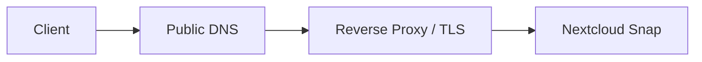

# Case Study: Nextcloud Snap Domain and HTTPS Configuration

## Context

A Nextcloud installation deployed through the Ubuntu Snap package needed to accept a custom domain and operate correctly over HTTPS. The application was already installed, but domain access failed or produced warnings because Nextcloud protects against unrecognised host headers.

The following example uses `cloud.example.com`; live domains and credentials are excluded.

---

## Requirement

- Access Nextcloud through a memorable domain.
- Keep the Snap deployment model.
- Configure Nextcloud to trust the domain explicitly.
- Support either direct Let's Encrypt configuration or operation behind a reverse proxy.
- Avoid editing Snap-managed files in unsupported locations.
- Validate DNS, TCP, TLS and application layers independently.

---

## Why the domain is not automatically accepted

Nextcloud uses the `trusted_domains` configuration to protect against host-header attacks. A working DNS record alone does not authorise the hostname inside the application.

Common symptoms include:

- “Access through untrusted domain”
- Redirects to an old IP address or hostname
- Incorrect HTTP/HTTPS scheme detection
- Login or WebDAV URLs using the wrong host
- Reverse-proxy loops

---

## Initial checks

### Confirm Snap services

```bash
sudo snap services nextcloud
sudo nextcloud.occ status
```

### Confirm listening ports

```bash
sudo ss -lntup | grep -E ':(80|443)\b'
```

### Confirm DNS

```bash
dig cloud.example.com A
dig cloud.example.com AAAA
```

The record must point to the intended public or private endpoint. An unwanted IPv6 record can cause clients to reach a different path from the tested IPv4 address.

### Test HTTP/TLS separately

```bash
curl -I http://cloud.example.com/
curl -vkI https://cloud.example.com/
```

This distinguishes DNS and connectivity issues from Nextcloud application configuration.

---

## Inspect current trusted domains

```bash
sudo nextcloud.occ config:system:get trusted_domains
```

Typical output may include an installation IP address or original hostname.

To add the custom domain at an unused numeric index:

```bash
sudo nextcloud.occ config:system:set trusted_domains 1 \
  --value=cloud.example.com
```

Recheck:

```bash
sudo nextcloud.occ config:system:get trusted_domains
```

Existing values should not be replaced accidentally. The numeric index must be selected after viewing the current list.

---

## Deployment model A: Snap handles HTTPS directly

The Nextcloud Snap includes tooling for Let's Encrypt.

### Preconditions

- Public DNS points to the server.
- TCP 80 and 443 reach the Snap instance.
- No reverse proxy or other web server is already occupying those ports.
- The domain is publicly resolvable.
- An email address is available for certificate notices.

Enable Let's Encrypt:

```bash
sudo nextcloud.enable-https lets-encrypt
```

The command prompts for the required details.

Validation:

```bash
sudo nextcloud.occ status
sudo snap services nextcloud
curl -I https://cloud.example.com/
openssl s_client -connect cloud.example.com:443 \
  -servername cloud.example.com </dev/null 2>/dev/null \
  | openssl x509 -noout -subject -issuer -dates
```

### Common direct-HTTPS failure causes

- Port 80 is not reachable for validation.
- DNS still points to an old address.
- Carrier-grade NAT or upstream firewall prevents inbound access.
- Another service already owns port 80/443.
- An AAAA record points somewhere incorrect.
- Rate limits have been reached after repeated tests.

---

## Deployment model B: Nextcloud behind a reverse proxy

In this design, the proxy receives public HTTPS and forwards traffic to the Snap instance on a private path.



### Proxy awareness

Nextcloud may need explicit settings so it generates HTTPS URLs and trusts forwarded information.

Example commands:

```bash
sudo nextcloud.occ config:system:set overwritehost \
  --value=cloud.example.com

sudo nextcloud.occ config:system:set overwriteprotocol \
  --value=https
```

A trusted proxy can be added using the correct proxy address or network:

```bash
sudo nextcloud.occ config:system:set trusted_proxies 0 \
  --value=10.10.60.10
```

The actual value must match the environment. Trusting an overly broad network weakens the protection.

Review values:

```bash
sudo nextcloud.occ config:system:get overwritehost
sudo nextcloud.occ config:system:get overwriteprotocol
sudo nextcloud.occ config:system:get trusted_proxies
```

### Generic Nginx proxy example

```nginx
server {
    listen 443 ssl http2;
    server_name cloud.example.com;

    ssl_certificate     /etc/letsencrypt/live/cloud.example.com/fullchain.pem;
    ssl_certificate_key /etc/letsencrypt/live/cloud.example.com/privkey.pem;

    client_max_body_size 10G;
    proxy_read_timeout 3600s;
    proxy_send_timeout 3600s;

    location / {
        proxy_pass http://nextcloud.internal.example:80;
        proxy_set_header Host $host;
        proxy_set_header X-Real-IP $remote_addr;
        proxy_set_header X-Forwarded-For $proxy_add_x_forwarded_for;
        proxy_set_header X-Forwarded-Proto https;
    }
}
```

This is a sanitised baseline, not a complete replacement for the current Nextcloud reverse-proxy documentation.

---

## Validation checklist

### DNS

```bash
dig cloud.example.com A +short
dig cloud.example.com AAAA +short
```

### Network

```bash
nc -vz cloud.example.com 443
```

### Certificate

```bash
openssl s_client -connect cloud.example.com:443 \
  -servername cloud.example.com </dev/null
```

### HTTP response

```bash
curl -vkI https://cloud.example.com/
```

### Application status

```bash
sudo nextcloud.occ status
sudo nextcloud.occ config:system:get trusted_domains
```

### User functions

- Login works.
- Browser does not show mixed-content or certificate warnings.
- File upload works.
- Desktop/mobile client connects.
- WebDAV URL uses the expected hostname.
- Shared links use HTTPS and the correct domain.

---

## Troubleshooting scenarios

### Untrusted domain remains after adding the hostname

Check:

- Correct Snap instance is being administered.
- The requested hostname matches exactly.
- Browser is not using a different alias.
- The domain was added at a valid index.
- Reverse proxy preserves the `Host` header.

```bash
sudo nextcloud.occ config:system:get trusted_domains
curl -vkI https://cloud.example.com/
```

### Redirect loop

Likely areas:

- Proxy sends HTTP upstream while Nextcloud repeatedly redirects to HTTPS.
- `X-Forwarded-Proto` is missing or wrong.
- `overwriteprotocol` conflicts with the actual design.
- Both proxy and Snap force incompatible redirects.

Check headers:

```bash
curl -vkIL --max-redirs 10 https://cloud.example.com/
```

### Domain redirects to an IP address

Possible causes:

- `overwritehost` contains the old value.
- Trusted domain ordering is not the issue; generated URL settings are.
- Proxy passes the upstream host instead of the original host.
- A cached browser redirect remains.

### Large uploads fail

Check:

- Proxy `client_max_body_size`
- Proxy timeouts
- PHP upload limits within the Snap
- Available disk capacity
- Temporary-file storage
- Connection stability

Relevant Snap commands may include:

```bash
sudo nextcloud.occ config:system:get trusted_domains
sudo nextcloud.occ status
df -h
```

The exact PHP tuning mechanism should be verified for the installed Snap version rather than editing arbitrary files under `/snap`.

### Certificate is valid in a browser but renewal fails

Check:

- Which component owns the certificate: Snap or reverse proxy.
- Whether port 80 validation still reaches the correct system.
- Whether DNS has changed.
- Whether the certificate was manually copied and no longer updates automatically.

Only one component should be treated as the certificate authority for the public endpoint.

---

## Security considerations

- Only required web ports are exposed.
- Snap administration remains private.
- SSH access is restricted.
- Reverse proxy is listed precisely as a trusted proxy.
- Administrative accounts use strong credentials and MFA where available.
- Nextcloud and Snap updates are reviewed and applied.
- Backups include user data, database and configuration.
- Public sharing is configured deliberately.

---

## Backup and recovery

A recoverable Nextcloud service requires more than the Snap package.

Protect:

- User data
- Database
- Nextcloud configuration
- Snap/application state
- Proxy configuration
- DNS records
- TLS ownership and renewal method

A recovery sequence should include:

1. Restore storage and permissions.
2. Restore Nextcloud/Snap data and database.
3. Confirm the application works locally.
4. Restore trusted domain and proxy settings.
5. Restore DNS and public proxy.
6. Issue or restore certificates through the chosen method.
7. Test browser, desktop client, mobile client and file sharing.

---

## Rollback

If proxy-specific settings break local access:

1. Record current configuration.
2. Remove only the relevant `overwritehost`, `overwriteprotocol` or trusted-proxy value.
3. Test local access.
4. Restore the previous proxy configuration.
5. Reapply settings one at a time.
6. Validate redirects and generated URLs.

Example removal syntax should be confirmed before use; configuration values can be reviewed with `config:system:get` and changed through `nextcloud.occ` rather than editing Snap-managed application files directly.

---

## Outcome

The domain was treated as a complete service path—DNS, network, TLS, proxy and application trust—rather than only a DNS record. This approach made faults easier to isolate and avoided unsupported changes inside the Snap package.

---

## Lessons learned

- DNS pointing at a server does not make an application trust the hostname.
- The component terminating TLS must be clearly identified.
- Reverse proxies require correct host and scheme headers.
- `trusted_proxies` should be narrow, not a broad shortcut.
- Redirect loops are best diagnosed by examining each HTTP hop.
- User validation must include clients and file uploads, not only the login page.
