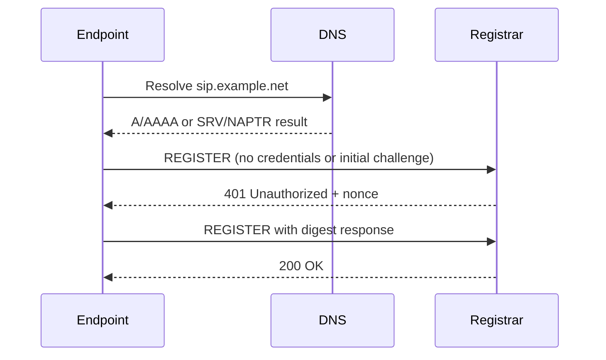

# Case Study: SIP Endpoint Registration Troubleshooting

## Context

A VoIP endpoint needed to register to a SIP service, but the available information did not clearly identify which value should be used as the registrar or server endpoint. This is a common support problem because providers and PBX platforms use different terminology for the same fields.

The case study documents a safe, layered process for identifying the required values and diagnosing registration without exposing real credentials or provider details.

---

## Requirement

Configure a phone, softphone or PBX trunk using the supplied account details and confirm successful SIP registration.

Typical information may include:

- Extension or account number
- Authentication ID
- Password
- SIP domain
- Registrar/server
- Outbound proxy
- Port
- Transport
- Display name

The challenge is that these fields are not interchangeable.

---

## Key SIP terms

| Term | Meaning | Common mistake |
|---|---|---|
| **SIP registrar** | Server that receives `REGISTER` requests | Entering the extension number instead of the server |
| **SIP server/domain** | Domain used for SIP routing and identity | Assuming it must be the same as the web portal |
| **Outbound proxy** | Optional server through which SIP requests are sent | Adding one when the provider does not require it |
| **Extension/account** | User-facing SIP address or PBX extension | Using it as the authentication ID when they differ |
| **Authentication ID** | Credential identity used during digest authentication | Using display name or caller ID instead |
| **Password** | SIP authentication secret | Using the web portal password |
| **Transport** | UDP, TCP or TLS | Choosing TLS without the correct port/certificate expectation |
| **Local SIP port** | Port used by the endpoint locally | Confusing it with the remote registrar port |
| **RTP ports** | Media stream ports | Opening only SIP signalling and forgetting audio |

---

## Logical registration flow



A `401 Unauthorized` during the initial exchange is often normal. The endpoint should respond using digest authentication. The final result determines success.

---

## Information-gathering sequence

### 1. Identify the service model

Determine whether the endpoint is registering to:

- A hosted SIP provider
- A 3CX PBX
- A FreePBX/Asterisk server
- A Grandstream UCM
- A session border controller
- A carrier trunk rather than an individual extension

The expected fields differ. A provider trunk may use IP authentication and no registration, while an extension normally registers with credentials.

### 2. Review supplied documentation

Look for wording such as:

- SIP registrar
- Proxy server
- Domain
- Host
- SBC address
- Provisioning URL
- FQDN

A web management URL is not automatically the SIP registrar.

### 3. Check DNS records

```bash
dig sip.example.net A
dig sip.example.net AAAA
dig _sip._udp.example.net SRV
dig _sip._tcp.example.net SRV
dig _sips._tcp.example.net SRV
dig example.net NAPTR
```

SIP services may publish SRV or NAPTR records that identify the host, port and transport.

### 4. Confirm network reachability

For TCP/TLS:

```bash
nc -vz sip.example.net 5060
nc -vz sip.example.net 5061
```

UDP reachability cannot be proven by a simple TCP test. Packet capture or SIP-client logs provide better evidence.

---

## Example endpoint configuration

```text
Account/Extension: 201
Authentication ID: user-201
Password: REDACTED
SIP Server/Registrar: sip.example.net
Outbound Proxy: blank unless required
Port: 5060
Transport: UDP
Registration expiry: provider/PBX default
```

The values are illustrative. A different environment may use:

- Extension `201` as both account and authentication ID
- A tenant-specific domain
- TCP or TLS
- Port 5061
- An SBC address for remote extensions
- No registration for an IP-authenticated trunk

---

## Initial validation

### Endpoint log

The endpoint should show a sequence ending in a successful response rather than a generic “failed” message.

Look for:

- DNS resolution
- Destination address and port
- Transport
- `REGISTER` request
- Challenge response
- Final SIP response code

### PBX/provider side

Check:

- Extension exists and is enabled.
- Authentication ID matches.
- Password was not copied with spaces.
- Registration is permitted from the source network.
- Remote extension/SBC requirement is met.
- Existing registration/contact limits are not exceeded.

### Packet capture

On a controlled network:

```bash
sudo tcpdump -ni any port 5060 or port 5061
```

For a host running Asterisk/FreePBX, tools may include:

```bash
asterisk -rvvv
pjsip set logger on
```

Sensitive SIP headers and credentials-derived information should not be published.

---

## SIP response-code interpretation

| Code | Meaning in context | Likely action |
|---:|---|---|
| `200 OK` | Registration accepted | Confirm expiry and audio path |
| `401 Unauthorized` | Often normal digest challenge | Ensure endpoint retries with correct auth ID/password |
| `403 Forbidden` | Credentials, policy or source rejected | Verify auth details and provider/PBX restrictions |
| `404 Not Found` | User/domain not found | Check extension and SIP domain |
| `408 Request Timeout` | No usable response | Check DNS, route, firewall, NAT and server availability |
| `423 Interval Too Brief` | Registration expiry too short | Use server-specified minimum |
| `480 Temporarily Unavailable` | User/service unavailable | Check PBX state and registration policy |
| `503 Service Unavailable` | Server cannot handle request | Check service health or provider status |

Response codes must be read with logs and message flow. A single code without context can be misleading.

---

## Troubleshooting scenarios

### No DNS resolution

```bash
getent hosts sip.example.net
dig sip.example.net
```

Check:

- Correct server hostname
- Client DNS settings
- VPN DNS behaviour
- Typo or expired domain
- A/AAAA/SRV records

### Endpoint sends nothing

Check:

- Account is enabled.
- Registration is enabled.
- Server field is not blank.
- Network interface and default gateway are correct.
- Provisioning has not overwritten manual settings.
- Endpoint clock is correct for TLS.

### Repeated `401 Unauthorized`

An initial 401 is normal, but repeated challenges may indicate:

- Wrong authentication ID
- Wrong password
- Incorrect realm/domain
- Endpoint not responding with digest authentication
- Provider expects extension and auth ID to differ

### `403 Forbidden`

Check:

- Credentials
- Account lock or status
- Source-IP restrictions
- Remote registration policy
- SBC requirement
- Too many simultaneous contacts
- Trunk is IP-authenticated rather than registration-based

### Timeout

Check:

- DNS result
- Route and firewall
- NAT
- SIP ALG interference
- Wrong port or transport
- IPv6 path failure
- Provider/PBX service status

### Registered but no audio

Registration proves signalling only. Audio requires RTP.

Check:

- RTP port range
- NAT/public-address configuration
- One-way routing
- Firewall state
- Codec compatibility
- SDP addresses
- SBC/media relay

Packet capture should compare SIP signalling with RTP streams.

### Registration drops periodically

Check:

- NAT timeout shorter than registration interval
- Keepalive configuration
- Registration expiry
- Endpoint sleep/power-saving
- WAN changes
- Multiple devices using the same account
- Provider contact limits

---

## 3CX considerations

In 3CX environments, remote endpoints may be provisioned through an SBC, router phone or supported tunnel design rather than direct generic SIP registration.

Relevant checks include:

- PBX FQDN
- Extension authentication details
- Provisioning method
- SBC availability
- Remote phone support
- Firewall checker results
- Extension restrictions

Manual SIP settings should not be used to bypass the platform's recommended security model without understanding the consequences.

---

## FreePBX/Asterisk considerations

For PJSIP extensions, relevant fields include:

- Endpoint/extension
- Authentication object
- AOR/contact
- Transport
- Match/identify rules for trunks
- NAT and external address settings

Useful CLI commands:

```text
pjsip show endpoints
pjsip show endpoint 201
pjsip show contacts
pjsip set logger on
```

For chan_sip legacy environments, commands differ. The active channel driver must be identified first.

---

## Security considerations

- SIP passwords are not the same as portal passwords.
- Credentials are never included in screenshots or repositories.
- Remote registration is restricted where possible.
- TLS protects signalling but requires correct certificate validation.
- SRTP should be used where supported and correctly configured.
- SIP management interfaces remain private.
- Default extensions and weak passwords are avoided.
- International and premium-rate dialling policy is reviewed.
- Emergency-call behaviour is documented clearly for community or lab services.

A successful registration should not be treated as proof that dial-plan and fraud controls are safe.

---

## Validation after registration

1. Confirm endpoint shows registered.
2. Confirm PBX/provider shows the expected contact.
3. Make an internal or controlled test call.
4. Verify two-way audio.
5. Test inbound and outbound routes within authorised scope.
6. Confirm caller ID behaviour.
7. Confirm DTMF if required.
8. Monitor registration stability.
9. Record server, transport and provisioning method securely.

---

## Rollback

If a change makes registration worse:

1. Export or record current endpoint settings.
2. Restore the previous registrar, transport and account values.
3. Remove unnecessary outbound proxy settings.
4. Restart only the endpoint registration process where possible.
5. Confirm the previous contact reappears.
6. Preserve logs and packet capture for review.

---

## Outcome

The issue was approached by separating the endpoint identity from the network destination and by validating DNS, transport, authentication and PBX policy independently. This avoided guessing that any domain or portal address was the SIP endpoint.

---

## Lessons learned

- Registrar, authentication ID, extension and outbound proxy are separate concepts.
- Initial `401 Unauthorized` can be normal SIP digest behaviour.
- DNS SRV/NAPTR records may define the correct server and port.
- Registration success does not prove RTP/audio will work.
- SIP ALG can create intermittent faults and should be evaluated carefully.
- Platform-supported provisioning is usually safer than copying generic settings blindly.
