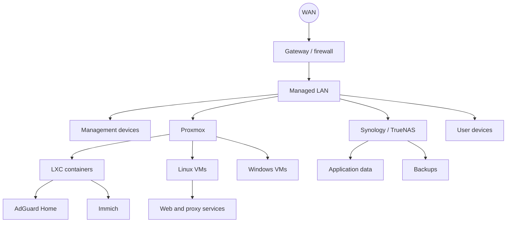

# My homelab

My homelab started as a way to learn VMware and Windows Server. It has since been rebuilt several times and now covers Proxmox, Linux, networking, storage, DNS, backups, hosting and VoIP.

It is not a fixed “finished” environment. I change it when I want to test something, when hardware dies, or when a better way of doing something becomes obvious.

## What is running

The main platform is Proxmox VE. I use a mix of virtual machines and LXC containers, with network storage provided by Synology and TrueNAS systems.

The lab has included:

- Windows Server and Windows client VMs
- Ubuntu and Debian servers
- AdGuard Home for DNS
- Immich for photo storage
- Nginx and reverse proxy services
- Nextcloud
- Monitoring tools
- Web hosting control panels
- 3CX and FreePBX test systems
- Ollama and Open WebUI
- Backup targets over SMB

## How it fits together

## The parts I care about most

### DNS must still work when other things are down

I learned quite quickly that putting every core service on one complicated stack is a bad idea. DNS is small, but almost everything feels broken when it stops working. I keep it on a lightweight VM or container and avoid making it dependent on optional services.

### Application data should not live only inside one VM

For services such as Immich, I prefer the application and its data to be separable. That makes a failed or rebuilt VM less dramatic. It also forces me to think about permissions, mounts and backup paths properly.

### Remote access should go through a VPN

I use WireGuard for private access. I do not expose Proxmox, NAS management or other admin interfaces directly to the internet.

### Backups need a restore plan

I used to think “the files are copied somewhere else” was enough. It is not. A useful backup needs the application data, the configuration, any database, and enough notes to put it back together.

## Things that have gone wrong

This is the useful part of a homelab.

- Proxmox storage failed because the SMB path and permissions did not line up.
- An LXC could see a mounted folder but could not write to it.
- Internal names resolved on one device and failed on another because they were using different DNS servers.
- A reverse proxy worked by IP but failed by hostname.
- Certbot was installed and the certificates existed, but the renewal path had not been tested.
- A VM refused to start because a storage dependency was unavailable.
- A service was “running” according to systemd but was not listening on the expected port.

I keep the detailed versions in [fixes](../fixes/).

## What I would change in a clean rebuild

I would use fewer one-off configurations, put more of the setup into Ansible, and document recovery at the same time as deployment rather than afterwards.

I would also be stricter about separating:

- core infrastructure
- things I use every day
- test systems
- public-facing services
- hardware I keep only for learning

That would make maintenance easier and reduce the number of “what was this VM for?” moments six months later.
