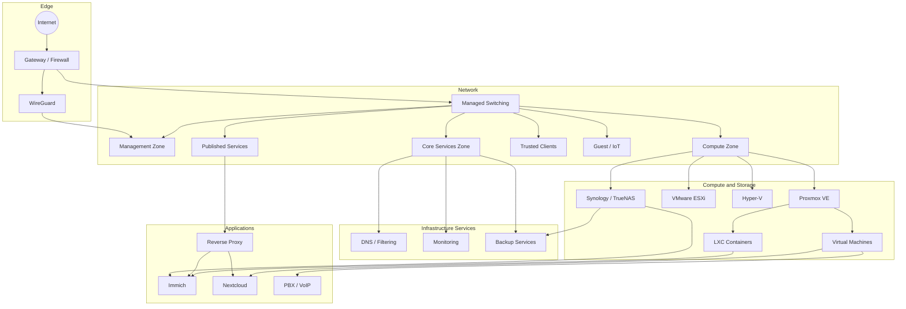
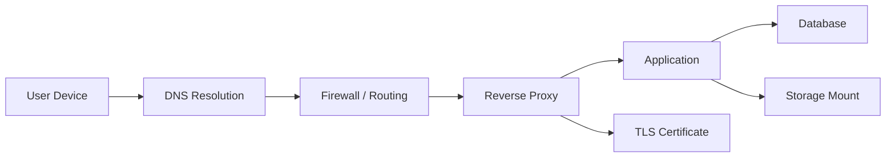

# Homelab Infrastructure Platform

## Full technical case study

This environment is a privately operated infrastructure lab used to design, deploy, support, troubleshoot and document systems similar to those found in small businesses, managed-service providers and internal IT departments.

It is not a collection of applications installed only for screenshots. The lab is used for practical work across server hardware, virtualisation, networking, storage, DNS, certificates, remote access, monitoring, backup, Linux, Windows and service recovery.

> **Scope statement:** The lab provides genuine hands-on experience, but it is not presented as a substitute for every aspect of enterprise production work. Availability, budget, staffing and change controls differ from a datacentre or large organisation. Those limitations are documented rather than hidden.

---

## Documentation map

| Document | Detail covered |
|---|---|
| [Architecture](architecture.md) | Compute, virtualisation, workload placement and dependency design |
| [Hardware inventory](hardware-inventory.md) | HPE, Dell, Supermicro, Synology, TrueNAS, MikroTik, UniFi and UPS equipment |
| [Detailed network topology](network-topology.md) | VLANs, trust boundaries, DNS, routing, VPN and diagnostics |
| [Networking design](networking.md) | Concise network principles and troubleshooting commands |
| [Service catalogue](service-catalogue.md) | Platforms installed, operated, supported or evaluated |
| [Hosted services](services.md) | Service operations, dependencies, proxying and updates |
| [Storage and backup](storage-backup.md) | SMB, iSCSI, NAS, RAID, backups and restoration thinking |
| [Security](security.md) | Exposure control, least privilege, secret handling and operational security |
| [Case studies](../case-studies/README.md) | Structured examples of implementation and troubleshooting |
| [Runbooks](../../runbooks/README.md) | Repeatable incident and maintenance procedures |

---

## Why the lab exists

The environment supports six main learning and operational goals.

### 1. Infrastructure design

To practise turning a requirement into a complete service rather than focusing on one product. A typical service may require:

- Compute resources
- Network placement
- DNS
- Storage
- Authentication
- Reverse proxying
- TLS certificates
- Monitoring
- Backups
- Recovery documentation

### 2. Hands-on support

To create realistic faults and operational situations that require evidence-led diagnosis, including:

- A VM that will not start
- An unavailable SMB share
- Incorrect DNS forwarding
- A service listening on the wrong interface
- A reverse proxy returning a 502 error
- An expired or failed certificate renewal
- Incorrect Linux ownership or permissions
- A SIP endpoint that cannot register

### 3. Cross-platform administration

To maintain practical familiarity with:

- Ubuntu and Debian
- Windows Server
- Proxmox VE
- VMware ESXi
- Hyper-V
- Synology DSM
- TrueNAS
- MikroTik RouterOS
- UniFi
- Docker and LXC

### 4. Operational discipline

To practise:

- Change planning
- Rollback thinking
- Maintenance windows
- Log review
- Monitoring
- Runbook creation
- Recovery sequencing
- Post-change validation

### 5. Security-conscious configuration

To avoid the common homelab pattern of exposing every management interface and reusing credentials. The design focuses on private administration, VPN access, segmentation, narrow firewall policy and exclusion of secrets from source control.

### 6. Clear technical documentation

To produce evidence that can be understood by another engineer or hiring manager. Documentation explains the problem, decisions and outcome rather than listing unexplained commands.

---

## Environment overview

### Compute

Representative compute platforms include:

- HPE ProLiant DL20 Gen9
- HPE ProLiant DL360 Gen9
- Dell PowerEdge R430 systems
- Dell PowerEdge R320
- Supermicro X10SDV-based server platform

Virtualisation work has included:

- Proxmox VE
- VMware ESXi 6.x/7.x-era environments
- Microsoft Hyper-V
- Linux VMs
- Windows Server VMs
- LXC containers
- Docker-hosted services

[See the complete hardware inventory](hardware-inventory.md).

### Network

The network uses managed switching and routing to separate systems according to trust and purpose.

Representative zones include:

- Management
- Compute
- Core infrastructure services
- Trusted user devices
- Guest/IoT devices
- Published services

Platforms include MikroTik and UniFi. Remote administration uses WireGuard-based private access where appropriate.

[See the detailed network topology](network-topology.md).

### Storage

Storage platforms and protocols include:

- Synology RackStation
- TrueNAS
- Local SAS RAID
- SMB/CIFS
- iSCSI
- Application-specific local storage
- Local and off-site backup targets

A key design principle is separating valuable data from replaceable compute where practical.

### Core services

The environment has included:

- AdGuard Home and internal DNS
- Reverse proxy and TLS services
- Monitoring and reachability checks
- Immich
- Nextcloud
- Web hosting and business applications
- 3CX and FreePBX environments
- Mail and filtering platforms
- Docker and Portainer
- Local AI services

[See the service catalogue](service-catalogue.md).

---

## Architecture

The live environment is deliberately not reproduced exactly. Public diagrams describe architecture and trust relationships without exposing addresses or management paths.

---

## Design decisions

### VM vs LXC vs Docker

A workload is placed according to its isolation, operating-system and recovery requirements.

| Platform | Chosen when | Trade-offs |
|---|---|---|
| Full VM | Different kernel/OS, Windows, strong isolation or appliance expectations | Higher overhead but clearer isolation |
| LXC | Linux service, low overhead, quick backup/restore and controlled host integration | Shares host kernel; permissions and bind mounts need care |
| Docker | Application supports containers and benefits from repeatable service definitions | Adds container networking, volumes and image lifecycle |
| Physical host | Hardware access, dedicated storage or infrastructure role justifies it | Less portable and usually higher power use |

### Data separation

Where practical:

- Application binaries and operating system remain on the compute host.
- User data is placed on a defined volume or NAS share.
- Databases are included in application-aware backup planning.
- Proxy, DNS and certificate dependencies are recorded.
- Recovery does not depend solely on a single VM snapshot.

### Core-service independence

DNS, storage and management access should not depend unnecessarily on optional applications. For example, a photo platform failing should not remove internal DNS or the only backup path.

### Private administration

Hypervisor, storage, gateway and switch management are accessed from trusted networks or VPN paths. Public access is limited to selected application services through a proxy.

---

## Workload inventory model

Each important workload should have the following record:

| Field | Purpose |
|---|---|
| Service name | Clear human-readable identity |
| Business/technical purpose | Why it exists |
| Owner | Who is responsible |
| Host | VM, LXC, Docker host or appliance |
| Resource allocation | CPU, memory and storage |
| Network zone | Trust and routing context |
| DNS | Internal/public records |
| Storage | Configuration, database and user-data paths |
| Dependencies | DNS, NAS, database, proxy, identity, internet or licensing |
| Monitoring | Host, port, HTTP, certificate or application checks |
| Backup | What is copied and where |
| Restore order | Sequence required to return service |
| Update method | Package, container, appliance or application process |
| Rollback | Snapshot, backup, previous image or manual reversal |

This model is being applied progressively across the portfolio.

---

## Example dependency chain

A published application can fail even when its VM is running.

A useful support process checks each dependency independently instead of repeatedly restarting the application.

---

## Operational lifecycle

### Deploy

1. Define the requirement and expected users.
2. Choose VM, LXC, Docker or physical platform.
3. Allocate network zone and DNS name.
4. Define data paths and backup scope.
5. Install using documented steps.
6. Apply minimum required access.
7. Configure monitoring.
8. Test from the user perspective.
9. Record recovery and update methods.

### Change

1. Record current version/configuration.
2. Review dependencies and impact.
3. Verify backup state.
4. Define validation and rollback.
5. Make one controlled change.
6. Check logs and service health.
7. Validate through normal user access.
8. Update documentation.

### Incident

1. Confirm impact and scope.
2. Establish what changed.
3. Check monitoring and dependencies.
4. Gather logs and state.
5. Test the smallest useful hypothesis.
6. Restore service safely.
7. Validate and communicate.
8. Record cause and prevention.

### Retire

1. Confirm the service is no longer required.
2. Export required data/configuration.
3. Remove DNS, proxy and monitoring entries.
4. Revoke credentials and VPN access.
5. Remove the workload after a retention period.
6. Update inventories and documentation.

---

## Monitoring model

Monitoring is designed around layers:

| Layer | Example check | What it proves |
|---|---|---|
| Host | Ping or agent | Host/network reachability |
| Port | TCP connection | Service is listening and reachable |
| Protocol | HTTP/DNS/SIP query | Protocol responds |
| Application | Expected page/API response | Application is functioning |
| Dependency | NAS mount, database or DNS | Supporting component is available |
| Security lifecycle | Certificate expiry | Prevents avoidable TLS outage |

A green ping alone does not prove the application works.

---

## Backup and recovery priorities

### Priority 1 — core access and infrastructure

- Network gateway configuration
- DNS configuration
- Hypervisor configuration
- Storage configuration
- VPN access

### Priority 2 — important data services

- NAS data
- Databases
- User files and photos
- Backup catalogues and credentials

### Priority 3 — application compute

- VMs and LXC containers
- Docker Compose definitions
- Proxy configuration
- Application configuration

### Priority 4 — replaceable test systems

- Temporary VMs
- Disposable labs
- Cached media
- Evaluation platforms

Recovery order depends on service dependencies. Restoring an application before its storage or database is available can create misleading additional faults.

---

## Representative operational work

- Installed and maintained Proxmox hosts
- Created Linux and Windows workloads
- Deployed LXC-based services
- Mounted SMB storage on Linux hosts
- Passed host storage into containers
- Diagnosed permissions and inaccessible data paths
- Configured internal DNS and conditional forwarding
- Built private WireGuard access paths
- Published selected services through Nginx/reverse proxy
- Issued and renewed Let's Encrypt certificates
- Deployed and updated Immich and Nextcloud
- Worked with Synology and TrueNAS storage
- Evaluated iSCSI for virtualisation
- Built and troubleshot 3CX/FreePBX environments
- Investigated VM start, network and storage failures
- Maintained Ubuntu and Debian systems
- Supported Windows Server workloads
- Documented change and recovery procedures

---

## Case studies

- [Proxmox SMB storage integration](../case-studies/proxmox-smb-storage.md)
- [Internal DNS and conditional forwarding](../case-studies/internal-dns.md)
- [Immich LXC deployment](../case-studies/immich-lxc.md)
- [Nextcloud Snap domain configuration](../case-studies/nextcloud-snap-domain.md)
- [SIP registration troubleshooting](../case-studies/sip-registration.md)

---

## Known limitations

- The lab does not provide datacentre-grade power, cooling or carrier diversity.
- Some hardware is older enterprise equipment used for learning and cost efficiency.
- Not every service has active-active redundancy.
- Maintenance may involve planned downtime.
- Monitoring and automation are still being expanded.
- Recovery procedures are documented progressively and need more recorded restore tests.

These limitations create useful engineering decisions around prioritisation, failure domains and cost rather than invalidating the work.

---

## Planned development

- Add sanitised screenshots and interface walkthroughs
- Record restore tests with measured recovery time
- Expand Windows Server and Microsoft 365 case studies
- Add Ansible-based Linux baseline deployment
- Add central logging and more useful alerting
- Add certificate-expiry and backup-failure alerts
- Document UPS-triggered shutdown behaviour
- Add configuration validation scripts
- Continue converting previous incidents into case studies
