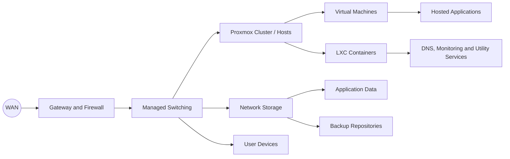

# Homelab Architecture

## Overview

The environment follows a layered design: network edge, managed switching, virtualisation, storage and application services. This makes faults easier to isolate and allows individual components to be changed without redesigning the entire platform.

## Virtualisation layer

Proxmox VE provides the main compute platform. Workloads are separated into virtual machines or LXC containers according to isolation, operating-system and application requirements.

A full virtual machine is preferred when:

- A different kernel or operating system is required
- Stronger workload isolation is useful
- The application expects a conventional server environment
- Windows Server is required

An LXC container is preferred when:

- The workload is Linux-based
- Lower overhead is useful
- The service has a narrow purpose
- Fast backup and restoration are advantageous

## Representative hardware

The lab has used enterprise rack servers including HPE ProLiant and Dell PowerEdge systems, with SAS storage, ECC memory and remote-management capabilities. Exact production identifiers are deliberately omitted.

Using enterprise hardware provides experience with:

- RAID controllers and disk planning
- iLO or iDRAC-style remote management
- Memory population and hardware compatibility
- Firmware and hypervisor support
- Power, noise and capacity constraints
- Diagnosing hardware and virtualisation faults

## Workload placement

Workloads are placed according to availability needs, resource usage and dependencies. Core network services should not depend unnecessarily on optional application platforms.

Examples:

| Workload type | Preferred platform | Reason |
|---|---|---|
| Internal DNS | Small Linux VM or LXC | Low overhead and simple recovery |
| Windows services | Virtual machine | Full Windows kernel and isolation |
| Photo management | Linux VM or LXC with mounted storage | Application isolation with external data storage |
| Reverse proxy | Linux VM or LXC | Small footprint and narrow exposure |
| Test systems | VM or LXC | Easy snapshots and disposal |

## Dependency awareness

A useful architecture document records dependencies rather than just hostnames. For example, an application may rely on:

1. Working switching and VLAN configuration
2. DNS resolution
3. A running VM or container
4. A mounted SMB or local dataset
5. A database
6. A reverse proxy and certificate

This dependency chain informs both monitoring and troubleshooting.

## Capacity and resilience

The lab is designed for learning and practical service operation rather than claiming datacentre-level availability. Resilience decisions are therefore documented honestly:

- Important data is separated from disposable compute where practical
- Backups are kept independently of the workload
- Services have documented dependencies
- Resource headroom is monitored
- Maintenance may still require planned downtime

## Future improvements

- Add repeatable deployment through Ansible
- Expand central logging and alerting
- Automate configuration validation
- Record recovery-time tests
- Produce version-controlled network diagrams
