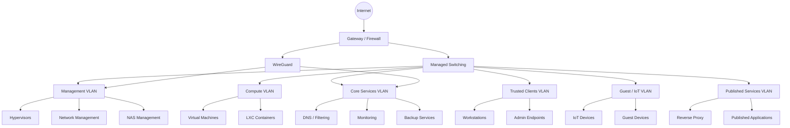
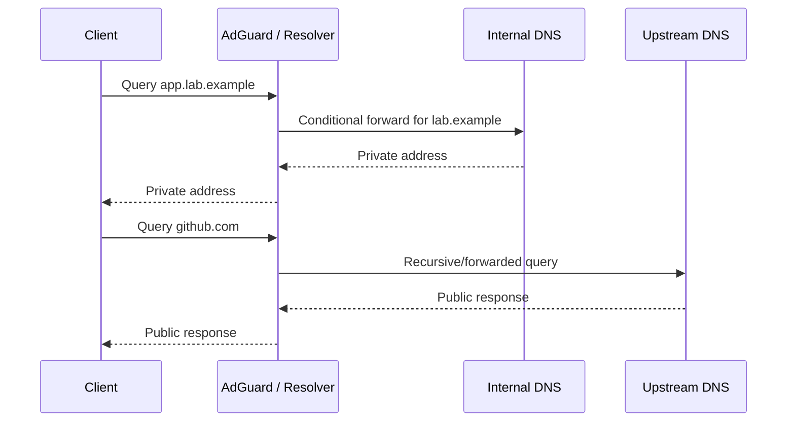

# Detailed Network Topology and Trust Model

This document explains the design approach used in my homelab networking. It intentionally uses example VLAN IDs, subnets and domains rather than live values.

The purpose of the design is to make the network easier to secure, troubleshoot and change. It avoids treating every internal device as equally trusted.

---

## Design objectives

1. Keep hypervisor, firewall, switch and storage administration private.
2. Separate infrastructure services from end-user devices.
3. Restrict guest and IoT devices from initiating connections to trusted systems.
4. Permit storage protocols only where they are required.
5. Use internal DNS names rather than memorised addresses.
6. Use VPN access for remote administration instead of exposing management pages.
7. Make fault domains clear enough that incidents can be isolated quickly.
8. Preserve a practical design that can be operated without unnecessary complexity.

---

## Logical topology



---

## Example segmentation model

| Zone | Example VLAN | Example subnet | Purpose | Default trust position |
|---|---:|---|---|---|
| Management | 10 | `10.10.10.0/24` | Hypervisors, switches, gateways and NAS management | Highly restricted |
| Compute | 20 | `10.10.20.0/24` | General VMs and LXC containers | Restricted by service need |
| Core services | 30 | `10.10.30.0/24` | DNS, monitoring, backup and utility systems | Reachable only as required |
| Trusted clients | 40 | `10.10.40.0/24` | User and administrator workstations | Can consume approved services |
| Guest / IoT | 50 | `10.10.50.0/24` | Less-trusted and unmanaged devices | Internet-first, internal access denied |
| Published services | 60 | `10.10.60.0/24` | Reverse proxy and selected externally reachable applications | Narrow back-end access only |

This table is a published example, not a copy of the live network.

---

## Trust boundaries

### Management zone

Contains interfaces capable of controlling the environment. Examples include:

- Proxmox management
- iLO, iDRAC or IPMI
- Switch management
- Firewall/gateway administration
- NAS administration

Expected controls:

- Reachable only from approved administrator endpoints or VPN peers
- No direct guest/IoT access
- No public exposure
- Multi-factor authentication where supported
- Unique credentials and limited administrative accounts

### Compute zone

Contains VMs and containers that host general workloads.

Expected controls:

- Workloads do not automatically receive access to management interfaces
- East-west traffic is limited where practical
- Application access to storage is explicitly permitted
- Internet access is controlled according to update and application needs

### Core services zone

Contains services on which other systems depend, such as DNS, monitoring and backup.

Expected controls:

- Client access is limited to the required protocol and port
- Administration remains separate from normal service traffic
- Dependencies are monitored
- Recovery priority is higher than for optional applications

### Guest and IoT zone

Contains devices that are unmanaged, vendor-controlled or not trusted with internal access.

Expected controls:

- Internet access where appropriate
- No initiation toward management, storage or server networks
- DNS may be forced through an approved resolver
- Device-to-device traffic may be limited

### Published services zone

Contains the minimum components required to publish selected services.

Expected controls:

- Only required inbound ports are accepted
- Reverse proxy can reach only necessary back-end services
- Back-end databases are not directly internet reachable
- Management interfaces are kept on separate paths
- Logs and certificate state are monitored

---

## Example policy matrix

| Source | Destination | Example requirement | Default decision |
|---|---|---|---|
| Admin endpoint | Management | HTTPS/SSH to approved systems | Allow narrowly |
| Trusted client | Internal DNS | DNS queries | Allow |
| Trusted client | Application service | HTTPS or approved app port | Allow as required |
| Guest/IoT | Management | Any | Deny |
| Guest/IoT | Compute | Any | Deny unless explicitly justified |
| Published proxy | Back-end application | Specific application port | Allow narrowly |
| Application host | NAS | SMB/NFS to assigned share only | Allow narrowly |
| General server | NAS management | Any | Deny |
| VPN administrator | Management | Approved administration protocols | Allow by peer and need |

The objective is not to produce hundreds of rules. It is to define clear flows and deny unnecessary access.

---

## DNS architecture

Internal DNS provides stable names for services and supports troubleshooting.

A typical design includes:

1. Clients receive the approved internal resolver through DHCP or static configuration.
2. The resolver answers local records and filtering policy.
3. Queries for a dedicated internal zone can be forwarded to an authoritative internal resolver.
4. All other queries are sent to approved upstream resolvers.
5. Public DNS contains only records that genuinely need to be public.

Example flow:



Useful diagnostic commands:

```bash
resolvectl status
getent hosts app.lab.example
dig app.lab.example
dig @10.10.30.10 app.lab.example
dig +trace example.com
```

Checks should compare the system resolver, the chosen internal resolver and an external resolver rather than assuming every DNS failure has the same cause.

---

## DHCP and address management

The design separates:

- Dynamically assigned client addresses
- Reserved addresses for known infrastructure
- Static addressing where a platform genuinely requires it
- DNS names from physical host identity

Operational rules:

- Infrastructure addresses are documented
- Address reservations are preferred to undocumented manual settings where suitable
- Gateway and DNS options are validated per VLAN
- Duplicate-address symptoms are investigated before replacing network equipment

---

## Routing and policy routing

The lab has included MikroTik and UniFi routing work, including a requirement to route traffic from a selected host through a VPN path.

Policy-routing design must answer:

- Which source addresses are affected?
- Which destinations should use the alternate route?
- What happens if the VPN gateway is unavailable?
- Should DNS follow the same path?
- Is return traffic symmetric?
- Does NAT occur at the correct boundary?

A safe implementation should be tested using:

```bash
ip route
ip rule
traceroute <destination>
curl -4 https://ifconfig.me
```

Commands above are examples for validation; live addresses and routes are excluded.

---

## WireGuard remote access

WireGuard is used as a private access method rather than exposing management interfaces.

Peer design considerations:

- One key pair per peer
- Narrow `AllowedIPs` values
- Removal of lost or unused peers
- Documentation of who or what the peer represents
- Firewall policy matching operational need
- DNS configuration appropriate to the peer
- Testing that the peer cannot reach unnecessary networks

A remote administrator may require management and core-service access, while a backup peer may require only a single storage destination.

---

## Troubleshooting methodology

### Layer 1 — physical and link

- Is the port up?
- Is the cable/transceiver working?
- Does the interface negotiate correctly?
- Are errors or flaps present?

### Layer 2 — switching and VLAN

- Is the access VLAN correct?
- Are trunks carrying the expected tags?
- Is the native/untagged VLAN understood at both ends?
- Is the MAC address visible on the expected port?

### Layer 3 — addressing and routing

```bash
ip address
ip route
ip neigh
ping -c 4 <gateway>
traceroute <destination>
```

Questions:

- Does the host have the expected address and prefix?
- Is the gateway correct?
- Is there a route to the destination?
- Is return routing available?

### Name resolution

```bash
resolvectl status
getent hosts service.lab.example
dig service.lab.example
```

Questions:

- Is the correct resolver in use?
- Does the record exist?
- Is conditional forwarding working?
- Is stale cache involved?

### Transport and service

```bash
nc -vz service.lab.example 443
curl -vk https://service.lab.example/
ss -lntup
```

Questions:

- Is the destination port reachable?
- Is the application listening on the expected address?
- Is a reverse proxy returning a different error from the back end?

### Firewall and application

- Is the rule evaluated on the expected interface and direction?
- Does the application permit the client/network?
- Are proxy headers, hostnames or certificates causing the failure?
- Do logs show a deny, timeout, reset or application exception?

---

## Monitoring approach

Network monitoring should distinguish:

- Device unreachable
- Gateway reachable but service unavailable
- DNS failure
- Certificate failure
- Storage latency or loss
- VPN peer inactive

A single ping check is insufficient for understanding service health. Monitoring should test the dependency closest to the user experience where practical.

---

## Failure scenarios considered

| Failure | Expected impact | Diagnostic priority |
|---|---|---|
| Internal DNS unavailable | Names fail while IP connectivity may remain | Resolver health, DHCP DNS settings and upstream path |
| VLAN misconfiguration | Device reaches wrong network or no gateway | Switch port/tagging and host interface |
| NAS unavailable | Applications lose data paths; backups fail | Network, NAS health, authentication and mount state |
| VPN down | Remote administration or backup path lost | Peer handshake, routes, NAT and firewall |
| Reverse proxy unavailable | Multiple published apps appear down | Proxy host, certificates, upstream reachability |
| Gateway failure | Broad loss of inter-VLAN/internet connectivity | Gateway state, uplinks and failover options |

---

## Security statement

This document describes design patterns and diagnostic methods. It does not publish live subnets, peer keys, firewall exports, public addresses or management URLs.
